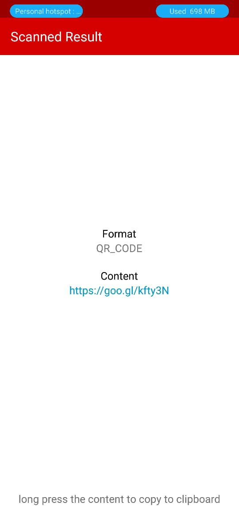

# BC Scanner
1D and 2D barcode scanner application.  
supports all barcode formats. Implemented using [zxing library](https://opensource.google.com/projects/zxing).

#### Download sample apk
[BC Scanner.apk](https://drive.google.com/file/d/17zMuoBSliIINh735C5dfK9mEfCz5alUQ/view?usp=sharing) [Android 5.1 (API level 22) or Above]

#### Images
 

